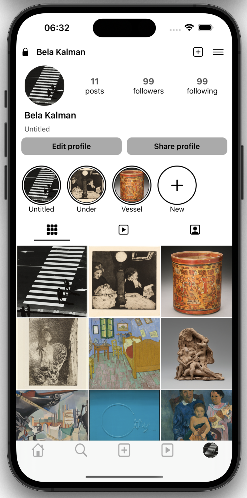
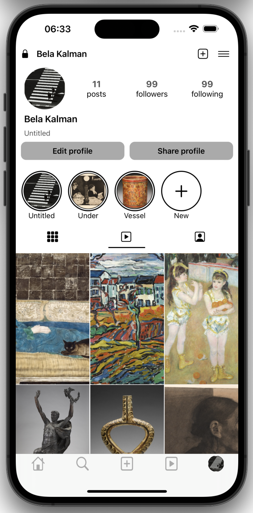
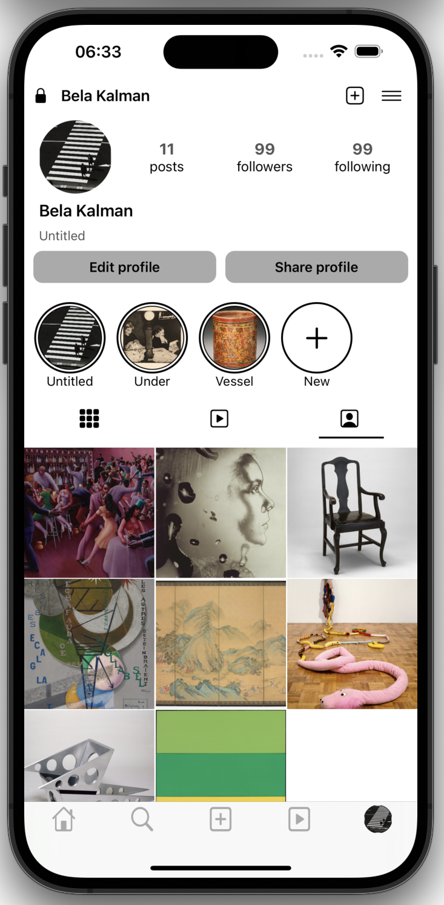

# InstaProfile

    
    
    

## Features

- Display user profile with profile image, username, and bio.
- Sections for posts, reels, and saved posts.
- Custom tab bar controller with five tabs.

## Architecture

- **MVVM (Model-View-ViewModel)**: Separates business logic from UI code to ensure cleaner code and better testability.
- **Combine**: Used for reactive programming and data binding.
- **Alamofire**: Handles network requests and data fetching.

